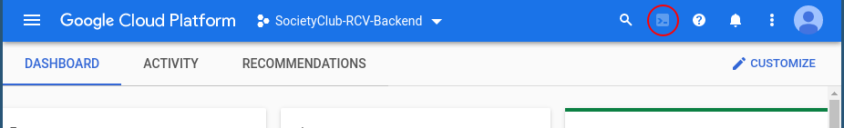

# About the Project

The backend for https://github.com/SocietyClub/RCV

# Getting Started

TODO

# Generating Go from an OpenAPI Spec
See [how-to-use-open-api-generator.md](how-to-use-open-api-generator.md) for details

# Deployment
Only package maintainers have access to deploy. These instructions are for them.

Once you are authorized to deploy through gcloud via your google account, you may download gcloud locally (https://cloud.google.com/sdk/docs/quickstart?authuser=5) or use the terminal from the online google console.

1. Go to https://console.cloud.google.com/home/dashboard?project=societyclub-rcv-backend and open the terminal (or download gcloud locally)

2. `gcloud config set project societyclub-rcv-backend`
    You can check if the config was set properly via `gcloud config list`
3. `git clone https://github.com/SocietyClub/RCV-backend.git`
4. `cd RCV-backend/helloworld`
5. `git pull`
6. `gcloud app deploy`

