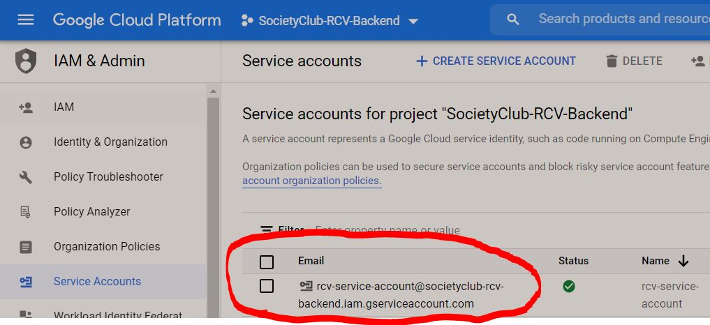
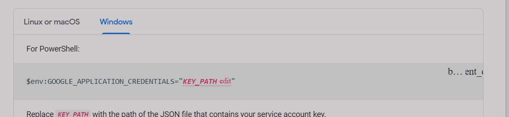
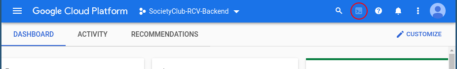

# Rank Choice Voting Backend API

## Table of Contents
  - [About the Project <a name="about"></a>](#about-the-project-)
  - [Contributing <a name="contributing"></a>](#contributing-)
  - [Restful Verb Documentation <a name="restful-verb-documenation"></a>](#restful-verb-documenation-)
  - [Getting Started <a name="start"></a>](#getting-started-)
    - [Generate credentials for service account](#generate-credentials-for-service-account)
  - [How To Run the API <a name="run"></a>](#how-to-run-the-api-)
      - [Clone the repository](#clone-the-repository)
      - [Running the API Locally](#running-the-api-locally)
  - [Other Development Info <a name="other"></a>](#other-development-info-)
    - [Generating Go from an OpenAPI Spec](#generating-go-from-an-openapi-spec)
    - [Deployment](#deployment)
_________________

## About the Project <a name="about"></a>
The backend for [Ranked Choice Voting](https://github.com/SocietyClub/RCV). 
For any questions regarding this project contact teamsocietyclub@gmail.com

## Contributing <a name="contributing"></a>

Follow these guidelines:

### Restful Verb Documentation <a name="restful-verb-documenation"></a>
Read this before you make changes to the API!

https://www.restapitutorial.com/lessons/httpmethods.html

## Getting Started <a name="start"></a>
Make sure to install Golang on your local system beforehand: https://golang.org/dl/

### Generate credentials for service account
1. Log into Google Cloud and head to Service accounts under the IAM & Admin page. https://console.cloud.google.com/iam-admin/serviceaccounts 



2. Select rcv-service-account and under action click *Manage Keys*
3. Create a new key, select json file format and save it for later. Do not save the key in this repo in case we accidently deploy it :) 
3. Provide authentication credentials to your application code by setting the environment variable GOOGLE_APPLICATION_CREDENTIALS



For more details check out: https://cloud.google.com/firestore/docs/quickstart-servers#go

## How To Run the API <a name="run"></a>

#### Clone the repository
```shell
git clone https://github.com/SocietyClub/RCV-backend.git
cd RCV-backend/api
go get
```

#### Running the API Locally
1. Copy service accounts credentials that you generated in the previous steps.
2. Paste credentials in RCV-backend\api\configs\config.yml under credentials inside the string.  

3. Run the following commands

```shell
cd RCV-backend/api
go run main.go
```
**DO NOT COMMIT PUSH CREDENTIALS, ALWAYS REMOVE THEM AFTER DEPLOYMENT**

## Other Development Info <a name="other"></a>

### Generating Go from an OpenAPI Spec
See [how-to-use-open-api-generator.md](how-to-use-open-api-generator.md) for details

### Deployment
Only package maintainers have access to deploy. These instructions are for them.

Once you are authorized to deploy through gcloud via your google account, you may download gcloud locally (https://cloud.google.com/sdk/docs/quickstart?authuser=5) or use the terminal from the online google console.

1. Go to https://console.cloud.google.com/home/dashboard?project=societyclub-rcv-backend and open the terminal (or download gcloud locally)



2. `gcloud config set project societyclub-rcv-backend`
    You can check if the config was set properly via `gcloud config list`
3. `git clone https://github.com/SocietyClub/RCV-backend.git`
4. `cd RCV-backend/helloworld`
5. `git pull`
6. `gcloud app deploy`
